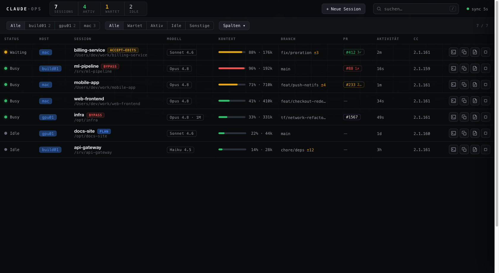
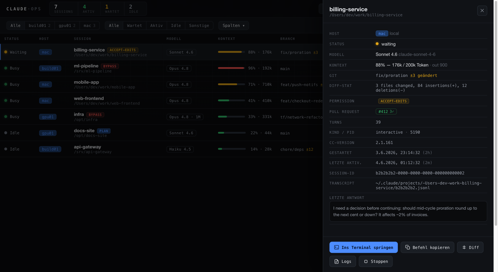
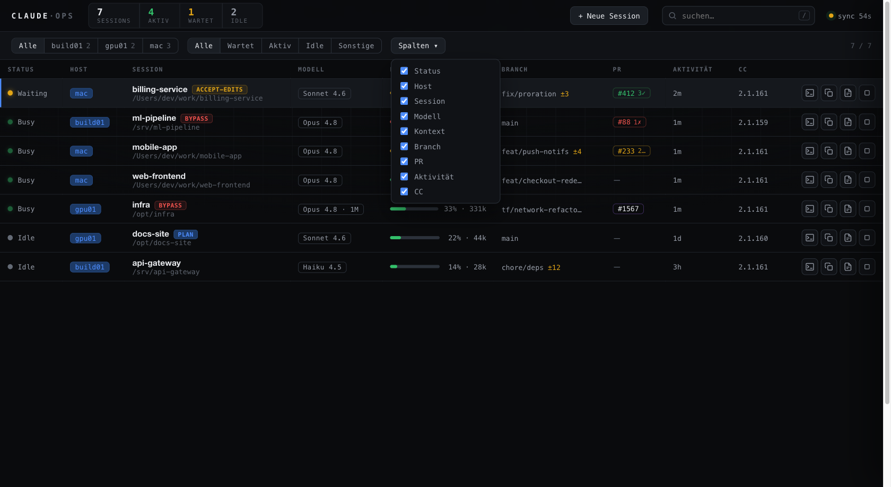
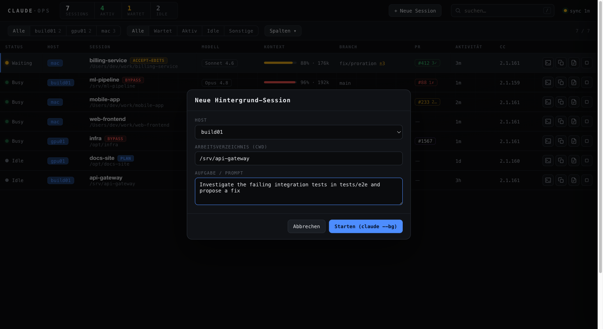
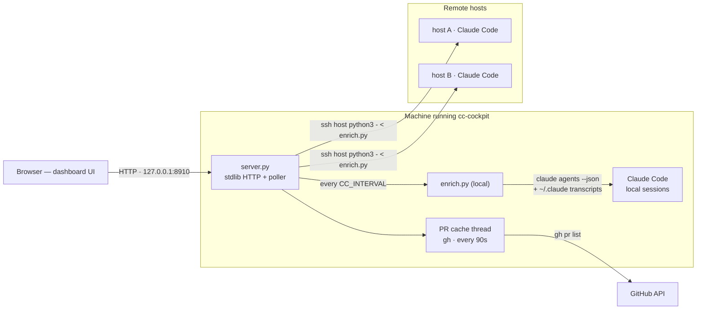
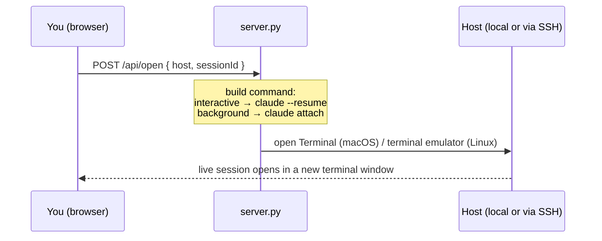

# cc-cockpit

A lightweight, self-hosted **operations dashboard for [Claude Code](https://docs.claude.com/en/docs/claude-code) sessions across many machines** — one screen showing every running session, what it's doing, how full its context is, and lets you jump straight into any of them.

It uses only the native `claude agents --json` output (no wrapper around the `claude` binary, no cloud, no telemetry). The dashboard runs locally and binds to `127.0.0.1` by default.



> Screenshots use anonymized demo data.

## Features

Per session, aggregated from your local machine **and** any number of remote hosts over SSH:

- **Status** (active / waiting-for-input / idle), grouped and sortable
- **Model** and **context-window fill %** (read from the session transcript; auto-detects 200k vs 1M windows)
- **Git** branch, dirty count, and an on-demand colored **diff**
- **Permission mode** badge (flags sessions running `bypassPermissions` / `acceptEdits` / etc.)
- **Pull request** status (open / checks / merged) via `gh`, refreshed in the background
- Last activity, Claude Code version, turn count, last assistant message
- **Jump into the terminal** of any session (one click → opens a terminal that attaches/resumes it)
- **Stop** a background session, or **start a new one** (`claude --bg`) from the UI
- Column show/hide (persisted), live search, host/status filters, keyboard shortcuts

## Screenshots

**Detail drawer** — everything about one session in one place, with row/drawer actions (jump into terminal, copy command, diff, logs, stop):



**Show/hide columns** (persisted in the browser) and **start a new background session** (`claude --bg`) from the UI:





## Requirements

- Python 3.7+ (standard library only — no pip install)
- [Claude Code](https://docs.claude.com/en/docs/claude-code) on each machine you want to monitor
- SSH access to remote hosts (key-based)
- Optional: [`gh`](https://cli.github.com/) (authenticated) for the PR column

## Install

```bash
git clone <your-repo-url> cc-cockpit
cd cc-cockpit
./install.sh
```

This installs an autostarting local service (launchd on macOS, `systemd --user` on Linux), generates a dedicated SSH key, and starts the dashboard at **http://127.0.0.1:8910**.

> The local machine's own sessions can only be read by a process running on that machine — that's why the collector runs natively (not in a container).

## Add more hosts

The easiest way — authorizes the dedicated key, verifies Claude Code, and registers the host:

```bash
./scripts/add-host.sh build01 deploy@build01.internal
```

Or edit `~/.config/cc-cockpit/hosts.conf` by hand:

```
build01|ssh|deploy@build01.internal
gpu|ssh|ubuntu@10.0.0.5
```

…then reload the service (see **Manage**). Each remote host just needs Claude Code installed and the dedicated public key in its `~/.ssh/authorized_keys` (add-host.sh does that for you).

## Configuration

Environment variables (set in the service unit, or when running `server.py` directly):

| Var | Default | Meaning |
|-----|---------|---------|
| `CC_PORT` | `8910` | HTTP port |
| `CC_BIND` | `127.0.0.1` | bind address (keep localhost unless you front it with auth) |
| `CC_INTERVAL` | `8` | poll interval in seconds |

Files live in `~/.config/cc-cockpit/` (config + key) and `~/.local/share/cc-cockpit/` (code, web UI, logs).

## Manage

```bash
# macOS
launchctl kickstart -k gui/$(id -u)/com.cc-cockpit.server   # reload
tail -f ~/.local/share/cc-cockpit/server.log

# Linux
systemctl --user restart cc-cockpit.service
journalctl --user -u cc-cockpit -f
```

## Security

- **No authentication** is built in — it binds to `127.0.0.1`. Only expose it on a trusted network / behind a VPN / behind an authenticating reverse proxy. Never put it on the public internet as-is.
- Uses a **dedicated SSH key** (`~/.config/cc-cockpit/id_cockpit`), never your personal key. For least privilege you can restrict that key on each host with a forced-command wrapper in `authorized_keys`.
- The "jump into terminal" and "new session" actions execute commands locally/over SSH — another reason to keep the bind address on localhost.

## Architecture



`enrich.py` is the core: it runs **identically** locally and — piped over SSH — **on each remote host**, so every machine reports the same rich data (model, context fill, git, permission mode, last message, …) in a single round-trip. Only `server.py` ever talks to the browser; remote hosts only run `claude agents --json` plus a read-only transcript scan. The PR column is refreshed by a separate background thread so `gh` latency never slows the main poll.

### Action flow — "jump into terminal"



### Files

| Path | Purpose |
|------|---------|
| `~/.local/share/cc-cockpit/server.py` | HTTP server + poller + action endpoints |
| `~/.local/share/cc-cockpit/enrich.py` | per-host data collection (local & over SSH) |
| `~/.local/share/cc-cockpit/web/index.html` | the single-file dashboard UI |
| `~/.config/cc-cockpit/hosts.conf` | host list (one line per source) |
| `~/.config/cc-cockpit/id_cockpit` | dedicated SSH key (never committed) |

## License

Copyright (C) 2026 GuniWeb moderne Medien GmbH

Licensed under the **GNU Affero General Public License v3.0 or later** (AGPL-3.0-or-later) — see [LICENSE](LICENSE). You may use it commercially for free; if you modify it and run it (including as a network service), you must make your modified source available under the same license.
